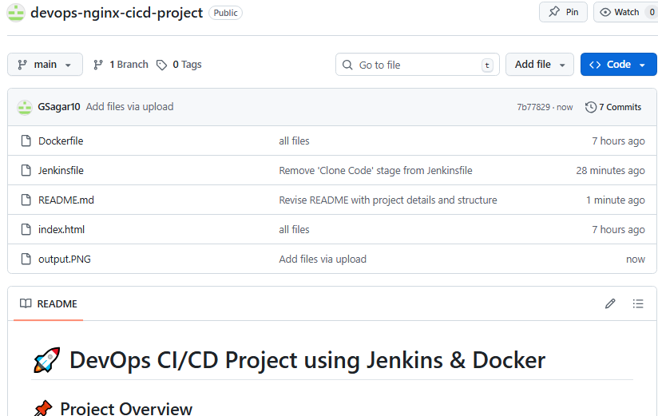
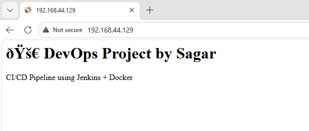

# 🚀 DevOps CI/CD Project using Jenkins & Docker

## 📌 Project Overview
This project demonstrates a complete CI/CD pipeline using Jenkins to automate Docker-based application deployment.

## 🔧 Tech Stack
- Jenkins
- Docker
- GitHub
- Linux
- Nginx

## ⚙️ Workflow
1. Code pushed to GitHub
2. Jenkins pulls latest code
3. Docker image is built
4. Old container is removed
5. New container is deployed

## 📦 Repository Structure

## 🌐 Application Output

## 👨‍💻 Author
Saagar Gharge
